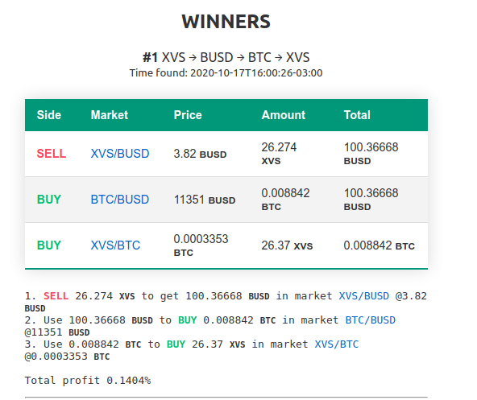

<!--
*** Thanks for checking out the Best-README-Template. If you have a suggestion
*** that would make this better, please fork the repo and create a pull request
*** or simply open an issue with the tag "enhancement".
*** Don't forget to give the project a star!
*** Thanks again! Now go create something AMAZING! :D
-->

<!-- PROJECT SHIELDS -->
<!--
*** I'm using markdown "reference style" links for readability.
*** Reference links are enclosed in brackets [ ] instead of parentheses ( ).
*** See the bottom of this document for the declaration of the reference variables
*** for contributors-url, forks-url, etc. This is an optional, concise syntax you may use.
*** https://www.markdownguide.org/basic-syntax/#reference-style-links
-->
[![Contributors][contributors-shield]][contributors-url]
[![Forks][forks-shield]][forks-url]
[![Stargazers][stars-shield]][stars-url]
[![Issues][issues-shield]][issues-url]

<!-- PROJECT LOGO -->
 

  <h3 align="center">Crypto triangular arbitrage</h3>

  

    Triangular arbitrage is the act of exploiting an arbitrage opportunity resulting from a pricing discrepancy among three different currencies.
     
    <a href="https://eugenioclrc.github.io/binance-crypto-triangular-arbitrage/">View Demo</a>
    <!--
    <a href="https://github.com/othneildrew/Best-README-Template"><strong>Explore the docs »</strong></a>
     
     
    ·
    <a href="https://github.com/othneildrew/Best-README-Template/issues">Report Bug</a>
    ·
    <a href="https://github.com/othneildrew/Best-README-Template/issues">Request Feature</a>
    -->
  

  

## About 🚀

_This is just a demo working only with binance._

<!-- MARKDOWN LINKS & IMAGES -->
<!-- https://www.markdownguide.org/basic-syntax/#reference-style-links -->
[contributors-shield]: https://img.shields.io/github/contributors/eugenioclrc/binance-crypto-triangular-arbitrage.svg?style=for-the-badge
[contributors-url]: https://github.com/eugenioclrc/binance-crypto-triangular-arbitrage/graphs/contributors
[forks-shield]: https://img.shields.io/github/forks/eugenioclrc/binance-crypto-triangular-arbitrage.svg?style=for-the-badge
[forks-url]: https://github.com/eugenioclrc/binance-crypto-triangular-arbitrage/network/members
[stars-shield]: https://img.shields.io/github/stars/eugenioclrc/binance-crypto-triangular-arbitrage.svg?style=for-the-badge
[stars-url]: https://github.com/eugenioclrc/binance-crypto-triangular-arbitrage/stargazers
[issues-shield]: https://img.shields.io/github/issues/eugenioclrc/binance-crypto-triangular-arbitrage.svg?style=for-the-badge
[issues-url]: https://github.com/eugenioclrc/binance-crypto-triangular-arbitrage/issues
[license-shield]: https://img.shields.io/github/license/eugenioclrc/binance-crypto-triangular-arbitrage.svg?style=for-the-badge
[license-url]: https://github.com/eugenioclrc/binance-crypto-triangular-arbitrage/blob/master/LICENSE.txt
[product-screenshot]: demo.png